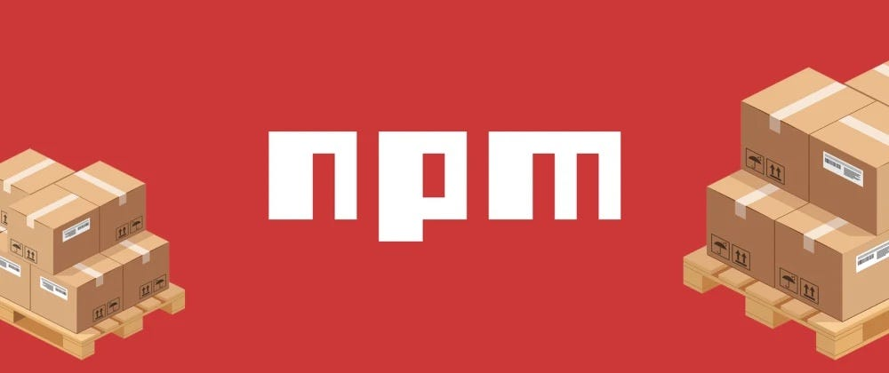

<!-- new slide -->

# Analyse Techniques

<!-- new slide -->

## Capturer les besoins techniques

Les package utilisé

{:width="900px"}*figure: Les package utilisé*

<!-- note -->

- Font Awsome Icons:
  - [Documentation : https://www.npmjs.com/package/@fortawesome/fontawesome-free](https://www.npmjs.com/package/@fortawesome/fontawesome-free)
  - **Commande:** *npm i @fortawesome/fontawesome-free*
  - **Version:** 6.5.2

- Rich Text Editor:
  - [Documentation : https://www.npmjs.com/package/@ckeditor/ckeditor5-build-classic](https://www.npmjs.com/package/@ckeditor/ckeditor5-build-classic)
  - **Commande:** *npm i @ckeditor/ckeditor5-build-classic*
  - **Version:** 41.3.1

- jQuery:
  - [Documentation : https://www.npmjs.com/package/jquery](https://www.npmjs.com/package/jquery)
  - **Commande:** *npm i jquery*
  - **Version:** 3.7.1

- AdminLTE:
  - [Documentation : https://www.npmjs.com/package/admin-lte](https://www.npmjs.com/package/admin-lte)
  - **Commande:** *npm install admin-lte@^3.1 --save*
  - **Version:** 3.1

- Laravel UI:
  - [Documentation : https://laravel.com/docs/7.x/authentication](https://laravel.com/docs/7.x/authentication)
  - **Commande:** *composer require laravel/ui:^2.4*
  - **Version:** 2.4

- Spatie:
  - [Documentation : https://spatie.be/docs/laravel-permission/v6/installation-laravel](https://spatie.be/docs/laravel-permission/v6/installation-laravel)
  - **Commande:** *composer require spatie/laravel-permission*
  - **Version:** 6.0

### Extension de vs code

- cscode-icons 
  <!-- note -->
  vscode-icons apporte une touche de brillance visuelle à votre espace de travail en remplaçant les icônes de fichiers par défaut par une vaste collection d’icônes attrayantes et intuitives.

- Todo Tree
- Test Explorer UI 
- Test Adapter Converter
- SQLTools SQLite 
- Prettier 
  <!-- note -->
  Prettier est un formateur de code largement adopté qui permet d’appliquer un style de code cohérent à l’ensemble de vos projets. Il prend en charge différents langages de programmation et formate automatiquement votre code selon des règles prédéfinies, améliorant ainsi la lisibilité et réduisant les conflits de style.

- PHP: Unit Test Explorer
- PhP Debug
- NMP Intellisence
- Markwdon All in One
- Luna Paint- Image Editor
- Live server 
  <!-- note -->
  Live Server est une extension fantastique qui vous permet de créer un serveur de développement local avec rechargement en direct. Il vous permet de prévisualiser vos modifications HTML, CSS et JavaScript en temps réel, vous évitant ainsi d’avoir à actualiser manuellement le navigateur.

- Laravel Blade Snippets
- Javascript(ES6) code snippers
- GitLens
- GitHub Copilot
- Git History
- Git Graph
- Composer
- Json
<!-- new slide -->

